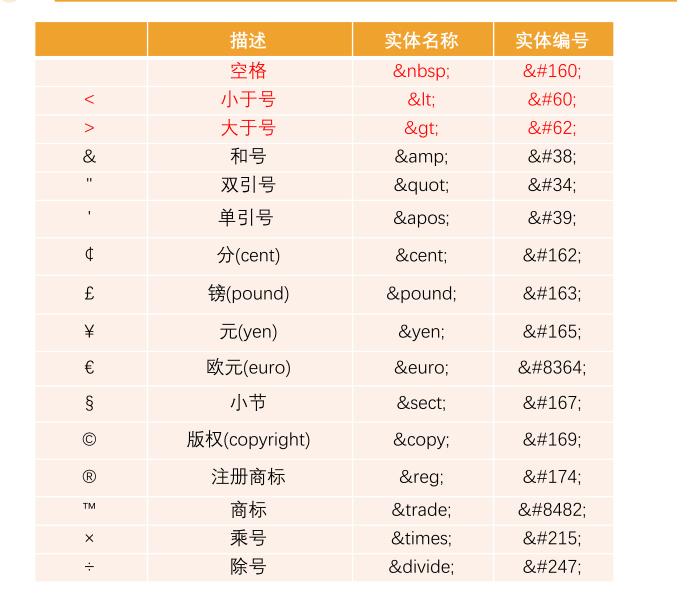
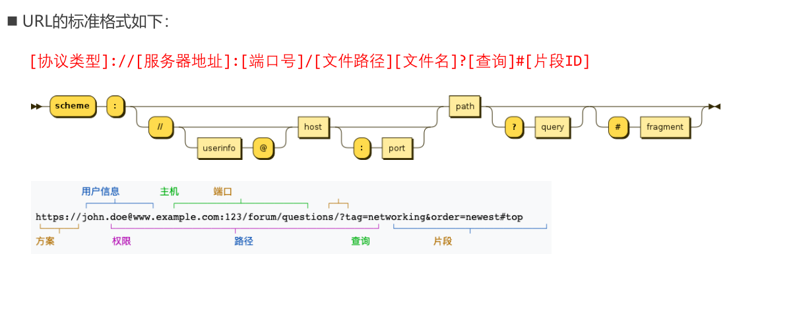

# 字符实体

# URL  (Uniform Resource Locator)

## URI

- URI = Uniform Resource Identifier 统一资源标志符，用于标识Web 技术使用的逻辑或物理资源
- URL = Uniform Resource Locator 统一资源定位符，俗称网络地址，相当于网络中的门牌号；

- URL作为一个网络Web资源的地址，可以唯一将一个资源识别出来，所以URL是一个URI
- 所以URL是URI的一个子集
- 但是URI并不一定是URL

# 元素的语义化

- 方便代码维护； 
- 减少让开发者之间的沟通成本； 
- 能让语音合成工具正确识别网页元素的用途，以便作出正确的反应； 
-  有利于SEO

# SEO

> 搜索引擎优化 （search engine optimization）是通过了解搜索引擎的运作规则来调整网站， 以及提高网站在有关搜索引擎内排名的方式。

# 字符编码

- https://www.jianshu.com/p/899e749be47c