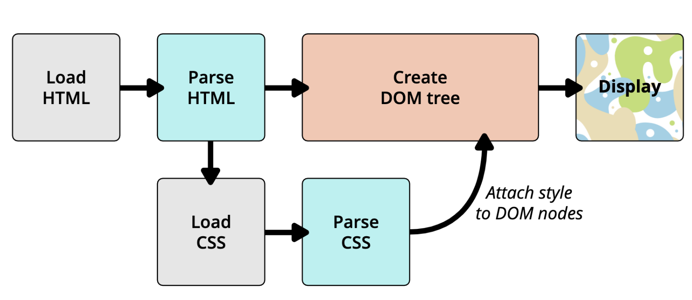

# link 元素

> link 元素是外部资源链接元素，规范了文档与外部资源的关系

- link 元素通常在 head 元素中
- 链接 CSS
- 创建 站点图标
- 属性
  - href
  - ref https://developer.mozilla.org/zh-CN/docs/Web/HTML/Link_types
    - icon
    - stylesheet

# 认识进制

- 二进制 `0b` binary
- 八进制 `0o` Octonary
- 十六进制 `0x` hexadecimal

# CSS 颜色的表示方法

- 颜色关键字 https://developer.mozilla.org/zh-CN/docs/Web/CSS/color_value#%E8%AF%AD%E6%B3%95
- RGB 颜色
  - #RRGGBB[AA]
  - #RGB[A]
  - 函数符 rgb\[a](R, G, B[, A])

# 浏览器的渲染流程

