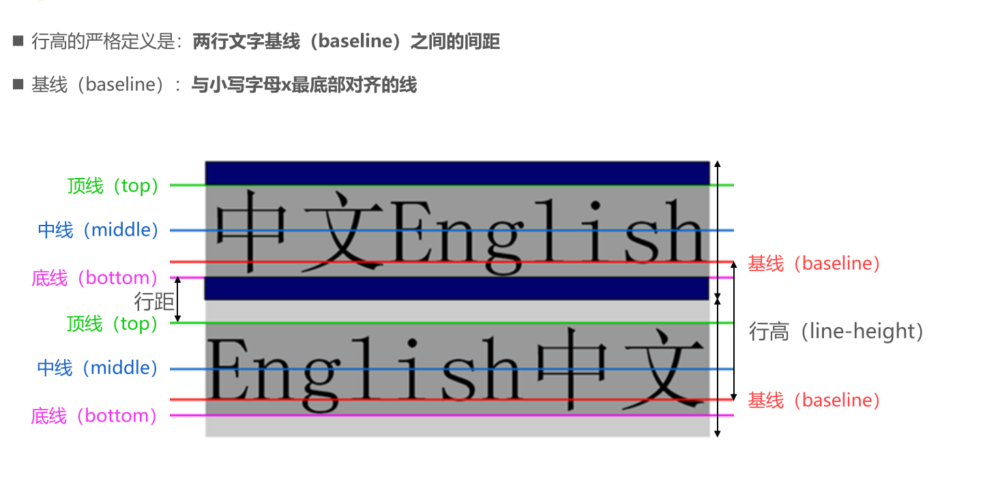

# CSS 属性-字体

## 1. font-size

> 默认 16 px

## 2. font-family

## 3. font-weight

- 100 | 200 | 300 | 400 | 500 | 600 | 700 | 800 | 900
- normal 400
- bold 700

## 4. font-style

- normal 常规显示
- italic 斜体 有对应的字体
- oblique 文字倾斜显示

## 5. font-variant

- normal
- small-caps 转化为大写字母，但大小是小写字母的大小

## 6. line-height 重要

- height = line-height 让文字垂直居中

## 7. font 缩写属性

> font 属性可以用来作为 font-style, font-variant, font-weight, font-size, line-height 和 font-family 属性的简写;

- font-style font-variant font-weight font-size/line-height font-family
- font-style、font-variant、font-weight可以随意调换顺序，也可以省略 
-  /line-height可以省略，如果不省略，必须跟在font-size后面 
- font-size、font-family不可以调换顺序，不可以省略

