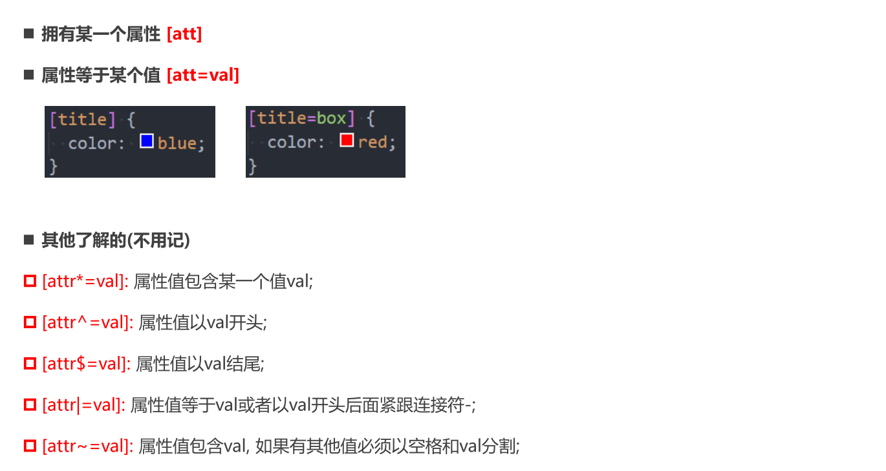
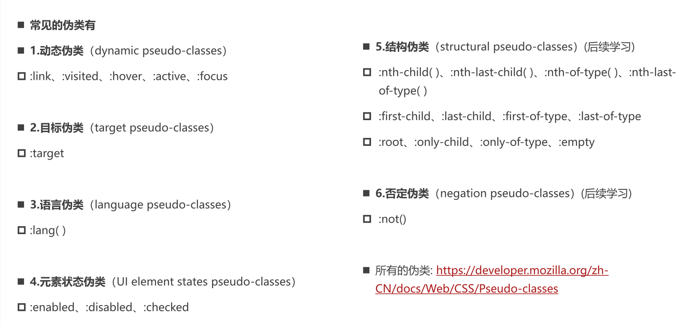

# 1. 通用选择器

`*` ，效率低，不推荐使用，会遍历所有的元素

# 2. 简单选择器

## 2.1 元素选择器 type selectors

## 2.2 类选择器 class selectors

## 2.3 id 选择器 id selectors

> 在一个 HTML 文档中 id 要唯一

# 3. 属性选择器 attribute selectors

# 4. 后代选择器 descendant combinator

- 以`空格`分隔，直接或间接子代
- 以 `>` 分隔，直接子代选择器

# 5. 兄弟选择器 sibling combinator

- 相邻兄弟 `+`
- 普通兄弟 `~`

# 6. 选择器组

## 6.1 交集选择器

- 两个选择器紧密连接

## 6.2 并集选择器

- 以 `,` 分隔

# 7. 伪类 Pseudo-classes

- https://developer.mozilla.org/zh-CN/docs/Web/CSS/Pseudo-classes

## 7.1 动态伪类 dynamic pseudo-classes

- a:link 未访问链接
- a:visited 已访问链接
- a:hover 鼠标挪动到链接上（重要）
- a:active 激活链接（鼠标在链接上长按未松开）
- :focus 具有焦点

> 顺序 link、visited、focus、haver、active

# 8. 伪元素 pseudo-elements

- :first-line, ::first-line
- :first-letter, ::first-letter
- :before, ::before 不能省略 `content`
- :after, ::after 不能省略 `content`

