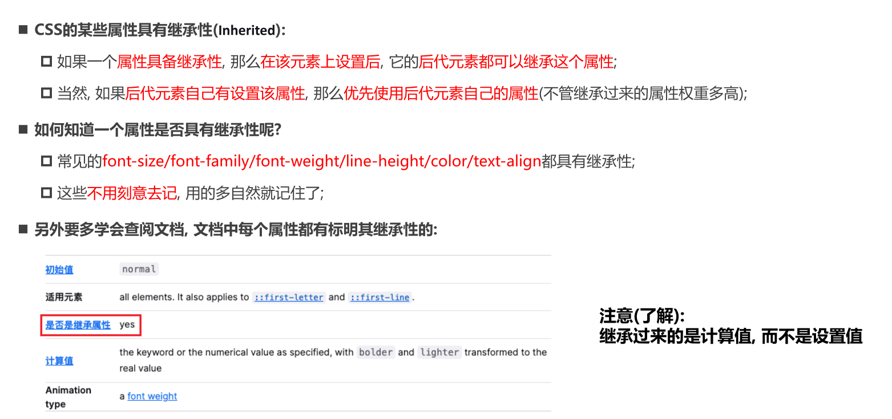
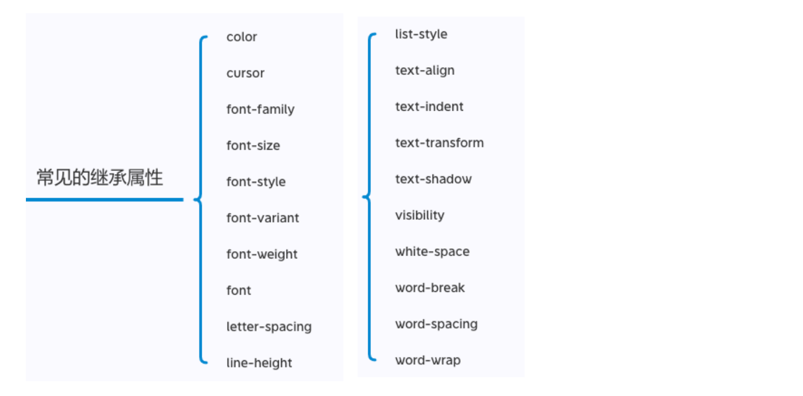
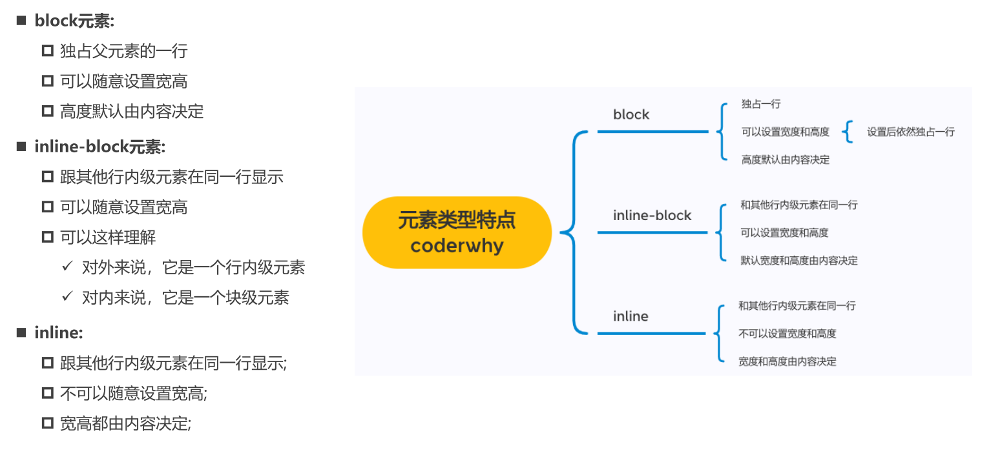

# 1. CSS的属性继承 Inherited

- inherit 强制继承

# 2. CSS属性的层叠

# 3. 选择器的权重

- !important 10000
- 内联样式 1000
- id 选择器 100
- 类选择器、属性选择器、伪类 10
- 元素选择器、伪元素 1
- 通配符 0

# 4. HTML 元素的类型

## 4.1 块级元素 block-level elements

- 独占**父元素**一行

## 4.2 行内级元素 inline-level elements

- **行内替换元素，可以设置宽高** , img, input

# 5. CSS修改元素的类型

## 5.1 display

- block
- inline
  - 不可以设置宽高，内容决定宽高
- inline-block
  - 开始设置宽高
- none

# 6. 编写HTML时的注意事项

## 6.1 块级元素、inline-block 元素

- 一般情况，可以包含其他任何元素（块级元素、行内级元素、inline-block元素)
- 特殊情况，**p元素不能包含其他块级元素**

## 6.2 行内级元素（a, span, strong...)

- 一般情况下，只能包含行内级元素

# 7. 元素隐藏方式

- divsplay: none
  - 元素不显示出来, 并且也不占据位置, **不占据任何空间**(和不存在一样);
- visibility
  - hidden 虽然元素不可见, 但是会**占据元素应该占据的空间**;
  - visible 元素是可见的
- rgba 
  - rgba的a设置的是alpha值, 可以设置透明度, **不影响子元素**
- opacity
  - 0 设置整个元素的透明度，**会影响到所有的子元素**

# 8. CSS 属性 overflow

- visible：溢出的内容照样可见 
- hidden：溢出的内容直接裁剪
- scroll：溢出的内容被裁剪，但可以通过滚动机制查看 
  - 会一直显示滚动条区域，滚动条区域占用的空间属于width、height 
-  auto：自动根据内容是否溢出来决定是否提供滚动机制