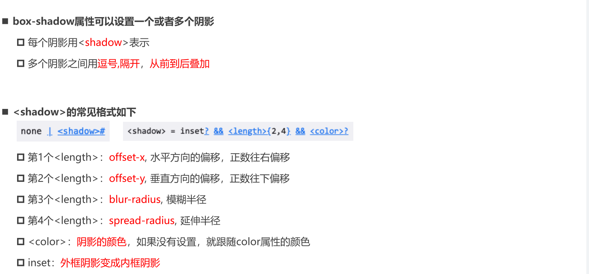

# 1. 盒子模型 Box Model


# 2. 内容 content

- width
- height
- min-width
- max-width
- min-height
- max-height

# 3. 内边距 padding

- top
- right
- bottom
- left

# 4. 边框 border

- width
- style
- color


- border-radius 圆角

# 5. 外边框 margin

- top
- right
- bottom
- left

## 5.1margin 的传递

## 5.2 margin 的折叠

## 5.2 块级元素的水平居中

# 6. 外轮廓 outline

# 7. 盒子阴影 box-shadow

- https://html-css-js.com/css/generator/box-shadow/



# 8. 文字阴影

- https://html-css-js.com/css/generator/text-shadow/

# 9. 行内非替换元素的特殊性

- width/height 不生效
- border  不占空间
- padding 不占空间
- 上下 margin 不生效

# 10. 前景色和背景色

- color
  - border
- background-color
  - padding

# 11. 盒子模型 box-sizing

- content-box
- border-box

# 12. 补充

## 12.1 文字一行显示 `...`

```css
white-space: nowrap;
overflow: hidden;
text-overflow: ellipsis;
```

## 12.2 文字多行显示 `...`

```css
display: -webkit-box;
-webkit-line-clamp: 3;
-webkit-box-orient: vertical;
```

