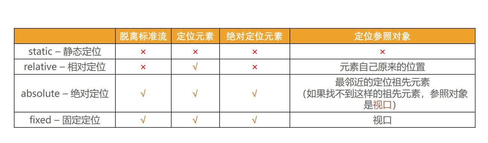

# 1. 标准流 normal-flow


# 2. 元素定位

position

- static 默认
- relative
- absolute
- fixed
- sticky

# 3. 静态定位 static

- 元素按 normal flow 布局
- left right top bottom 没有任何作用

# 4. 相对定位 relative

# 5. 固定定位 fixed

# 6. 绝对定位 absolute

- 在绝大数情况下，子元素的绝对定位都是相对于父元素进行定位
- 如果希望子元素相对于父元素进行定位，又不希望父元素脱标，常用解决方案是： 
  - 父元素设置position: relative（让父元素成为定位元素，而且父元素不脱离标准流） 
  - 子元素设置position: absolute 
  - 简称为“**子绝父相**”

- 绝对定位元素（absolutely positioned element） 
  - **position值为absolute或者fixed的元素**
- 对于绝对定位元素来说 
  - 定位参照对象的宽度 = left + right + margin-left + margin-right + 绝对定位元素的实际占用宽度
  -  定位参照对象的高度 = top + bottom + margin-top + margin-bottom + 绝对定位元素的实际占用高度
- 如果希望绝对定位元素的宽高和定位参照对象一样，可以给绝对定位元素设置以下属性 
  - `left: 0、right: 0、top: 0、bottom: 0、margin:0`
- 如果希望绝对定位元素在定位参照对象中居中显示，可以给绝对定位元素设置以下属性 
  - `left: 0、right: 0、top: 0、bottom: 0、margin: auto`
  - 另外，还得设置具体的宽高值（宽高小于定位参照对象的宽高）

- 水平垂直居中

```css
.container {
    position: absolute;
    width: 200px;
    height: 100px;
    background-color: #0f0;
    left: 0;
    right: 0;
    top: 0;
    bottom: 0;
    margin: auto;
}
```


# 7. 粘性定位 sticky

相对定位 relation 和 固定定位 fixed 的结合。sticky是相对于最近的滚动祖先包含视口的(the nearest ancestor scroll container’s scrollport )




# 7. 定位元素的属性 z-index

- z-index属性用来设置定位元素的层叠顺序（仅对定位元素有效） 

  - 取值可以是正整数、负整数、0\

- 比较原则 

  - 如果是兄弟关系 
    - z-index越大，层叠在越上面 
    - z-index相等，写在后面的那个元素层叠在上面 

  - 如果不是兄弟关系 
    - 各自从元素自己以及祖先元素中，找出最邻近的2个定位元素进行比较 
    - 而且这2个定位元素必须有设置z-index的具体数值

