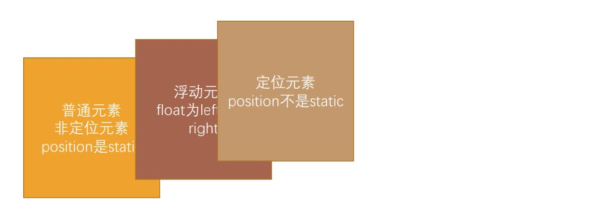
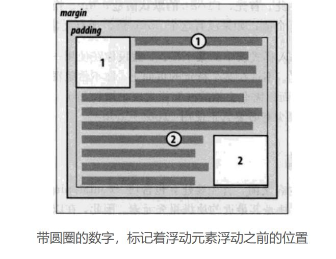
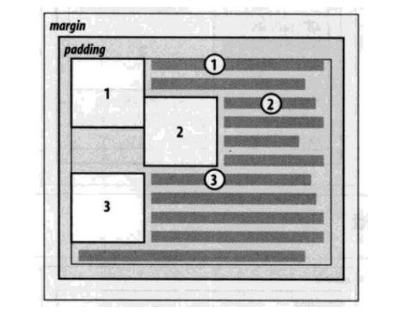

# 认识浮动

- float 属性可以指定一个元素应沿其容器的左侧或右侧放置，允许文本和内联元素环绕它。
  - float 属性最初只用于在一段文本内浮动图像, 实现文字环绕的效果; 
  - 但是早期的 CSS 标准中并没有提供好的左右布局方案, 因此在一段时间里面它成为网页多列布局的最常用工具; 
- 绝对定位、浮动都会让元素脱离标准流，以达到灵活布局的效果 
- 可以通过float属性让元素产生浮动效果，float的常用取值 
  - none：不浮动，默认值 
  - left：向左浮动 
  - right：向右浮动

# 浮动规则一

- 元素一旦浮动后, 脱离标准流  朝着向左或向右方向移动，直到自己的边界紧贴着包含块（一般是父元素）或者其他浮动元素的边界为止 
- 定位元素会层叠在浮动元素上面

# 浮动规则二

- 如果元素是向左（右）浮动，浮动元素的左（右）边界不能超出**包含块**的左（右）边界

# 浮动规则三

- 浮动元素之间不能重叠
  - 如果一个元素浮动，另一个浮动元素已经在那个位置了，后浮动的元素将紧贴着前一个浮动元素（左浮找左浮，右浮找右浮） 
  - 如果水平方向剩余的空间不够显示浮动元素，浮动元素将向下移动，直到有充足的空间为止

# 浮动规则四*

- **浮动元素不能与行内级内容重叠，行内级内容将会被元素推出**
  - 不如行内级元素、inline-block元素、**块级元素的文字内容**

# 浮动规则五

- 行内级元素、inline-block元素浮动后，其顶部将与所在行的顶部对齐

# 几个重要的点

- `margin` 设置为负值
- `clear`清除浮动
