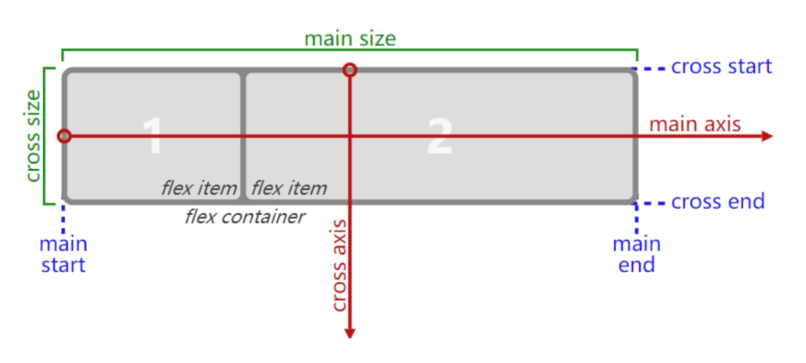
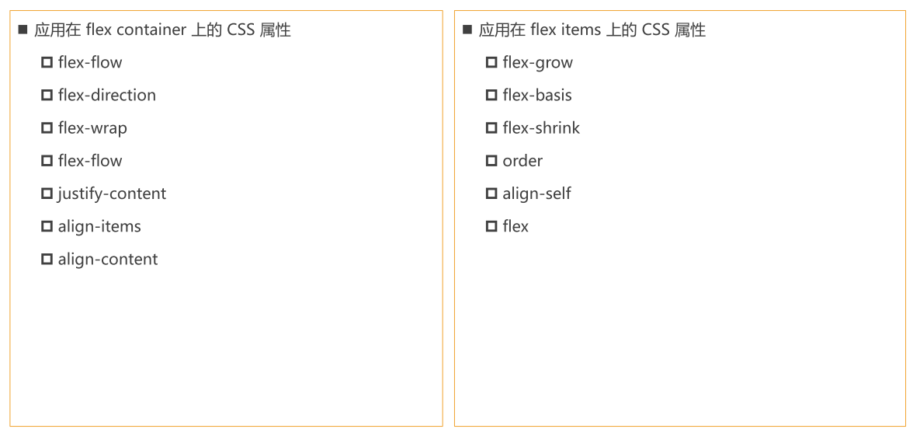

# 认识 flexbox

- Flexbox翻译为弹性盒子: 
  - 弹性盒子是一种用于按行或按列布局元素的**一维布局方法** ; 
  - 元素可以膨胀以填充额外的空间, 收缩以适应更小的空间; 通常我们使用Flexbox来进行布局的方案称之为flex布局(flex layout);
- flex布局是目前web开发中使用最多的布局方案： 
  - flex 布局（Flexible 布局，弹性布局）; 
  - 目前特别在移动端可以说已经完全普及; 
  - 在PC端也几乎已经完全普及和使用, 只有非常少数的网站依然在用浮动来布局;

# flex 重要概念

- 两个重要的概念：
  - 开启了 flex 布局的元素叫 flex container 
  - flex container 里面的直接子元素叫做 flex item
- 当flex container中的子元素变成了flex item时, 具备一下特点: 
  - flex item的布局将受flex container属性的设置来进行控制和布局; 
  - flex item不再严格区分块级元素和行内级元素; 
  - flex item默认情况下是包裹内容的, 但是可以设置宽度和高度;
- 设置 display 属性为 flex 或者 inline-flex 可以成为 flex container 
  - flex： flex container 以 block-level 形式存在 
  - inline-flex： flex container 以 inline-level 形式存在

# flex 布局常见问题

- n - 2